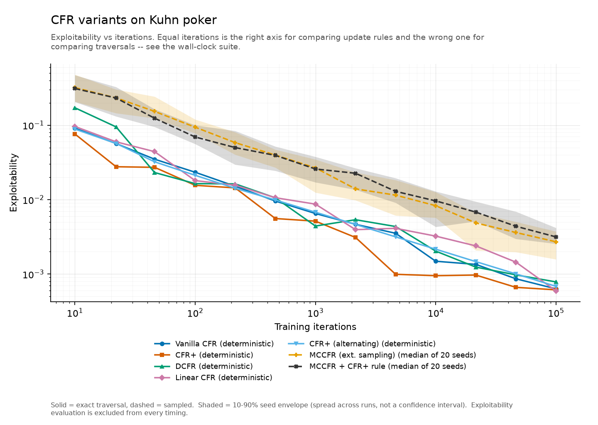
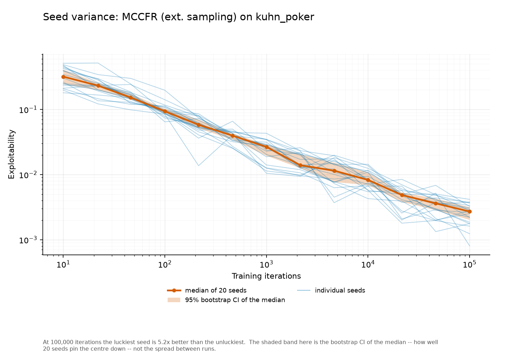
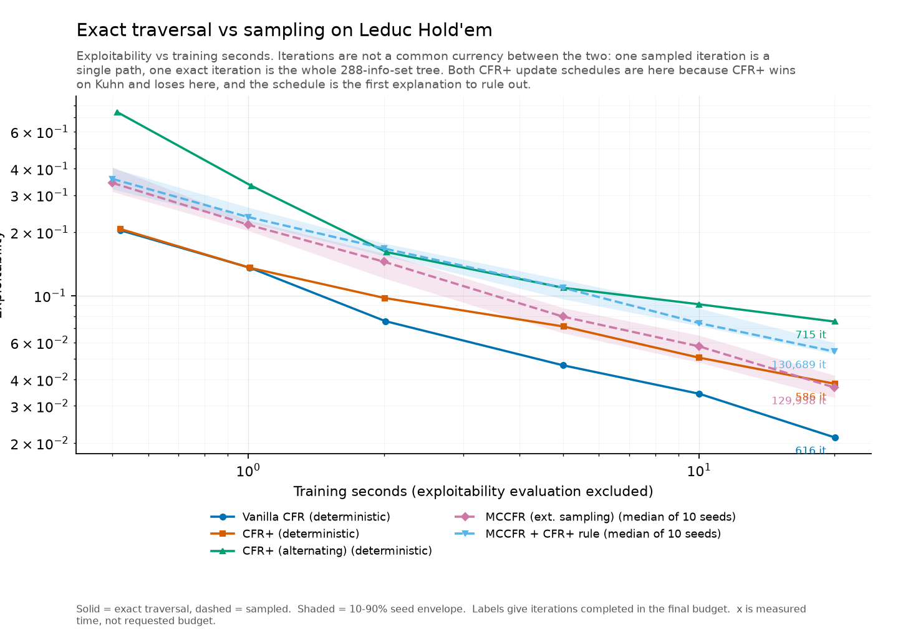
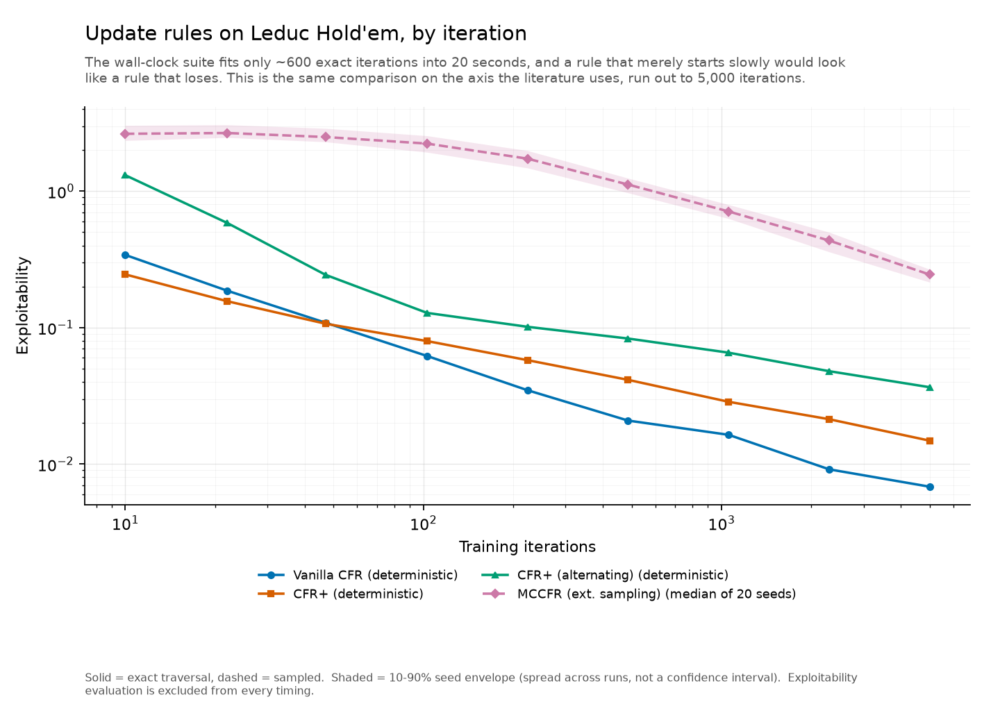
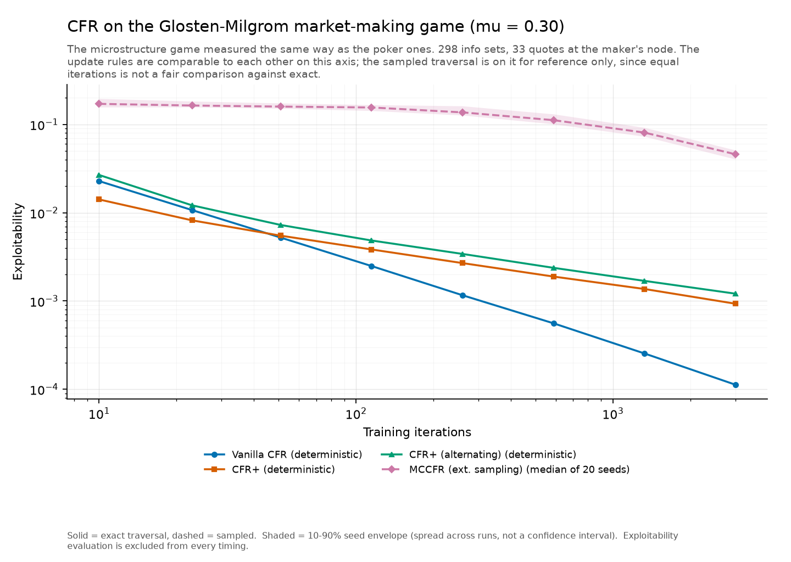
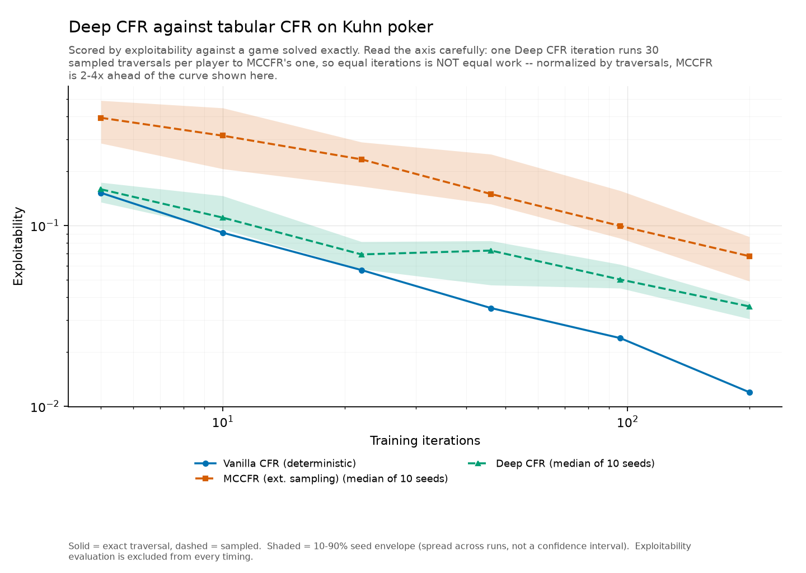

# Simplified GTO Solver

A from-scratch **Counterfactual Regret Minimization (CFR)** engine for extensive-form games
with imperfect information, validated on poker and aimed at market microstructure.

Solving poker is the *means*, not the end. Kuhn and Leduc poker have known equilibria, so
they serve as a correctness harness for the solver. The destination is a **Glosten–Milgrom
market-making game**, where a market maker quotes against possibly-informed order flow —
the same asymmetric-information problem CFR solves, and the mechanism behind adverse
selection and bid-ask spreads.

## Status

**All 10 phases complete.** Eight CFR variants across three games, an exploitability
metric that needs no published answer to check against, a benchmarking harness that reports
seeds and bands, a 2–3× optimization that left every convergence curve bit-identical, a CLI,
a dashboard, and Deep CFR with the network written from scratch. Everything runs on numpy;
matplotlib and streamlit are optional.

The results worth remembering are mostly negative, and they took the most work to trust:
**DCFR loses to vanilla** at its published defaults on small games; **CFR+ wins every Kuhn
checkpoint and loses on both other games**, unexplained; **Deep CFR loses to both tabular CFR
and MCCFR** once the axis is read correctly; and **exact traversal beats sampling** at every
Leduc budget, on every one of ten seeds. None were tuned away. See
[`docs/BUILDLOG.md`](docs/BUILDLOG.md) for how each was established and what is still open.

## Market microstructure

A market maker quoting against possibly-informed order flow is playing the same
asymmetric-information game CFR solves. Two canonical models are implemented, and they
needed **different tools** — which is the most interesting result here.

### Glosten–Milgrom: solved by CFR

The solver recovers the profit-maximizing quote exactly. The benchmark is an exhaustive
search over the quote grid that shares no code with the solver, so agreement is evidence
rather than a tautology:

| μ (informed share) | CFR spread | Brute-force optimum | Competitive GM spread |
|---:|---:|---:|---:|
| 0.02 | 1.6250 | 1.6250 | 0.0306 |
| 0.10 | 1.6250 | 1.6250 | 0.1561 |
| 0.30 | 1.8750 | 1.8750 | 0.4937 |
| 0.50 | 2.1250 | 2.1250 | 0.8699 |
| 0.70 | 2.5000 | 2.5000 | 1.3143 |

Exact match at every μ, with exploitability ≈ 0.002. The spread widens as informed flow
rises — adverse selection, recovered from self-play rather than assumed.

Two market makers appear in that table on purpose. The **competitive** GM maker earns zero
expected profit by construction, while CFR solves for a **profit-maximizing** one, which
quotes strictly wider. They answer different questions and neither is presented as the
other.

### Kyle (1985): deliberately *not* solved by CFR

Kyle's market maker is also competitive, and checking the numbers shows why that matters:
a strategic maker's PnL is `λ·σu² − S0/(4λ)`, **strictly increasing in λ without bound**,
with no interior optimum. Its PnL is exactly zero at the equilibrium `λ = √S0/(2σu)` — the
zero-profit condition, not an optimum. Kyle is genuinely not a two-player zero-sum game, so
it gets an iterated best-response **fixed-point solver** instead, validated against five
closed-form results:

| Quantity | Closed form | Recovered |
|---|---|---|
| Price impact | `λ = √S0 / (2σu)` | exact, from 6 parameter settings |
| Trading intensity | `β = σu / √S0` | exact |
| Product | `λβ = 1/2` | exact |
| Information revealed | exactly **half** the private signal | 0.5000 |
| Informed profit | `σu·√S0 / 2` | exact |

λ is also recovered *independently* by regressing simulated price on order flow (0.038%
error at 200k draws), which shares no algebra with the fixed-point solver.

Choosing the right algorithm per model — and saying plainly why CFR is wrong for one of
them — is the point of building both.

## Benchmarks

Every number below comes from `gto benchmark` and is written to
`results/*.json` with the machine, commit and seeds behind it. The tables are pasted from
what the script prints, so they are regenerated rather than transcribed.

Two rules make them comparable across phases, and both are enforced in code:

- **Stochastic variants are reported over fixed seeds with bands, never as a single run** —
  20 seeds on the convergence suites, 10 on the twenty-second Leduc budgets.
- **Deterministic variants are run once.** `FullTraversal` never reads the rng, so twenty
  seeds would be twenty identical curves and a band of width zero. That claim is checked by
  running the seeds and comparing strategies, not assumed.

A shaded band is always the 10–90% **seed envelope** — how much individual runs differ —
never a confidence interval, which is a narrower thing answering a different question.
Evaluating exploitability is never charged to a solver's clock.

### Algorithm comparison — Kuhn poker



| Iterations | Vanilla CFR | CFR+ | DCFR | Linear CFR | CFR+ (alternating) |
|---:|---:|---:|---:|---:|---:|
| 10 | 0.091144 | 0.076111 | 0.171237 | 0.096067 | 0.088585 |
| 100 | 0.023301 | 0.015560 | 0.016391 | 0.017999 | 0.021210 |
| 1,000 | 0.006505 | 0.005135 | 0.004416 | 0.008694 | 0.006771 |
| 10,000 | 0.001486 | 0.000951 | 0.002033 | 0.003232 | 0.002157 |
| 100,000 | 0.000633 | 0.000614 | 0.000784 | 0.000593 | 0.000683 |

| Iterations | MCCFR (ext. sampling) median | 10-90% over 20 seeds | MCCFR + CFR+ rule median | 10-90% over 20 seeds |
|---:|---:|---:|---:|---:|
| 10 | 0.319444 | 0.207292 - 0.478249 | 0.310525 | 0.205283 - 0.470130 |
| 100 | 0.093886 | 0.077691 - 0.119522 | 0.069377 | 0.055925 - 0.099972 |
| 1,000 | 0.026667 | 0.012435 - 0.034647 | 0.025784 | 0.017082 - 0.037637 |
| 10,000 | 0.008287 | 0.005703 - 0.012609 | 0.009609 | 0.004305 - 0.012881 |
| 100,000 | 0.002711 | 0.001577 - 0.003734 | 0.003155 | 0.002552 - 0.004176 |

- **CFR+ beats vanilla at all 13 measured checkpoints** on Kuhn.
- **DCFR loses at 9 of the 13**, including the last (0.000784 against 0.000633). An earlier
  single-grid reading recorded this as "wins early, worse around 10k"; the finer grid shows
  it is not that tidy — DCFR wins at 46, 100, 1,000 and 21,544 iterations and loses
  everywhere else.
- **MCCFR needs 21.5× more iterations** for the same accuracy, and two horizons agree on the
  factor: vanilla's exploitability at 100 iterations is first matched by MCCFR's median at
  2,154, and its 1,000-iteration value at 21,544. Vanilla at 10,000 is never matched inside
  100,000 MCCFR iterations. An earlier single-run estimate of 10–15× was too optimistic.
- **The CFR+ rule composed with external sampling** — a combination neither paper defines,
  available here because rules and traversals are independent — helps between 46 and 1,000
  iterations and trails afterwards. At 100,000 the two medians' 95% bootstrap CIs overlap
  ([0.00203, 0.00317] against [0.00274, 0.00386]), so twenty seeds do not resolve which is
  better. It does carry visibly less seed variance: 2.1× spread against 5.2×.

### One run is not a result



At 100,000 iterations MCCFR's twenty seeds span **0.000807 to 0.004165** around a median of
0.002711 — the luckiest seed is 5.2× better than the unluckiest. Every sampled number this
project published before this phase was a single run, and could have landed anywhere in that
range. That is what the bands are for.

### Exact traversal vs sampling — Leduc Hold'em



| Budget | Vanilla CFR | CFR+ | CFR+ (alternating) | MCCFR (ext. sampling) | MCCFR + CFR+ rule |
|---:|---:|---:|---:|---:|---:|
| 0.5s | 0.10559 | 0.12066 | 0.23245 | 0.33359 | 0.34688 |
| 1s | 0.06886 | 0.08739 | 0.13032 | 0.21475 | 0.23248 |
| 2s | 0.04326 | 0.07036 | 0.10542 | 0.13910 | 0.16789 |
| 5s | 0.02599 | 0.04587 | 0.08287 | 0.07342 | 0.10425 |
| 10s | 0.01758 | 0.03263 | 0.06717 | 0.05287 | 0.07273 |
| 20s | 0.01159 | 0.02515 | 0.05043 | 0.03604 | 0.05373 |

| Variant | Iterations in the final budget | Iterations/sec | Seeds |
|---|---:|---:|---:|
| Vanilla CFR | 1,720 | 86 | deterministic |
| CFR+ | 1,528 | 76 | deterministic |
| CFR+ (alternating) | 1,976 | 99 | deterministic |
| MCCFR (ext. sampling) | 141,957 | 7,098 | 10 |
| MCCFR + CFR+ rule | 138,086 | 6,904 | 10 |

- **Vanilla exact traversal beats every sampled variant at every budget**, and not only
  on the median: every one of the ten MCCFR seeds at 20 s is worse than the single exact
  run (best sampled 0.02869 against exact 0.01159). At 20 s the gap is 3.1×.
- It is *not* true that exact beats sampled variant-for-variant, and the table is the
  reason to say so precisely: **MCCFR beats alternating CFR+ from 5 s onward.** Which
  traversal wins depends on which update rule it is carrying.
- Sampling completes **83× more iterations per second** and still loses. That ratio was
  211× before the Phase 6 optimization, which is the honest catch: the optimization
  sped up exact traversal by 2.8× and sampling by 9%, so **a wall-clock comparison
  between two traversals is a statement about an implementation, not about the
  algorithms.** The per-iteration comparison below is the one that is not.

### CFR+ wins on Kuhn and loses on everything else

That is the phase's most interesting result, so it was checked on both axes and both update
schedules before being written down.



| Iterations | Vanilla CFR | CFR+ | CFR+ (alternating) |
|---:|---:|---:|---:|
| 10 | 0.341117 | 0.245522 | 1.310192 |
| 47 | 0.108595 | 0.106788 | 0.243655 |
| 103 | 0.061949 | 0.079673 | 0.128167 |
| 486 | 0.020843 | 0.041439 | 0.083194 |
| 5,000 | 0.006825 | 0.014839 | 0.036571 |

CFR+ leads for the first three checkpoints on Leduc, crosses over between 47 and 103
iterations, and ends **2.2× worse** than vanilla at 5,000. On the Glosten–Milgrom game the
same shape appears earlier — CFR+ leads at 10 and 23 iterations and ends **8.3× worse** at
3,000. Alternating updates, the schedule the published algorithm uses, are worse still on
both games, at every checkpoint.

So this is not a slow start, and it is not the update schedule. It is a real property of
this implementation on these games at these iteration counts, and it is recorded as measured
rather than tuned away. It is also unexplained, and published CFR+ results run far longer
than 5,000 iterations, so it is on the list for a correctness review rather than being
offered as a general claim about CFR+.

### The market-making game



The microstructure game runs through the same harness as the poker ones. Exact CFR drives
exploitability to **0.000113** at 3,000 iterations over its 298 info sets, at 183
iterations/sec.

### Performance

Phase 6 optimized the hot loop. The gate it had to pass is the one the harness was built
for: **throughput may move, per-iteration convergence curves may not.** They did not — the
maximum exploitability difference is `0.000e+00` on every run of every convergence suite,
across 7 algorithms, 13 checkpoints and 20 seeds.

| Game | Vanilla CFR | CFR+ | CFR+ (alternating) | DCFR | Linear CFR | Sampled |
|---|---:|---:|---:|---:|---:|---:|
| Kuhn | 2.03× | 1.98× | 1.99× | 1.73× | 1.79× | 0.97–1.03× |
| Leduc | 2.78× | 2.60× | 2.71× | — | — | 1.04–1.09× |
| Glosten–Milgrom | 3.14× | 3.16× | 3.26× | — | — | 1.05× |

Three changes, in the order profiling found them (`python scripts/profile_hotloop.py`):

1. **Counterfactual reach** was `np.prod(np.delete(reach, player))` — 14% of a Leduc run
   spent allocating an array at every decision node to drop one element from three.
2. **`payout(player)` was called once per player** at every terminal, and a two-player
   zero-sum game computes the same quantity both times. `GameState.payouts()` asks once.
   It is optional — the base-class default is correct for any game.
3. **The tree was re-derived every iteration.** Which nodes are terminal, the payoffs
   there, the chance probabilities, whose turn it is, the info-set key, the action count,
   and which node each action leads to are all fixed, because a `GameState` is immutable.
   `FullTraversal` now resolves the tree once. On 150 Leduc iterations that removes 1.4M
   `apply()` calls, 850k payoff computations and 567k info-set-key string builds — the
   game disappears from the profile entirely, leaving the regret arithmetic that is the
   actual work.

Two things worth reading off that table. The speedup **grows with the game**, 2.0× on Kuhn
to 3.1× on Glosten–Milgrom, because the more expensive a game's own methods are the more
there is to stop recomputing. And **sampling barely moves**, which is by design rather than
by omission: external sampling exists for trees too large to enumerate, so caching one
would take away its reason to exist. Most of those figures sit at or below the 3.2%
wall-clock noise floor measured in Phase 5; the largest, Leduc's 1.09×, is the `payouts()`
change, which does touch the sampled path.

### Deep CFR, and reading the axis carefully



Deep CFR (Brown et al. 2019) replaces the regret table with a network refitted every
iteration. The network is written from scratch in numpy — about eighty lines with Adam,
gradient-checked against finite differences — so the project gains no dependency for it.

| Iterations | Vanilla CFR | MCCFR median | Deep CFR median | Deep CFR 10–90% over 10 seeds |
|---:|---:|---:|---:|---:|
| 10 | 0.091144 | 0.313553 | 0.110430 | 0.095355 – 0.145768 |
| 22 | 0.056658 | 0.232038 | 0.069134 | 0.057279 – 0.081303 |
| 46 | 0.034898 | 0.149167 | 0.072594 | 0.046791 – 0.082195 |
| 96 | 0.023800 | 0.099279 | 0.050183 | 0.044949 – 0.060846 |
| 200 | 0.011947 | 0.067597 | 0.035639 | 0.030422 – 0.037836 |

At equal iterations Deep CFR beats MCCFR by 2–3× and loses to exact tabular CFR by up to
3×. **The first half of that is an artifact of the axis, and this project has now hit the
same trap three times in three different disguises.** One Deep CFR iteration runs 30
sampled traversals per player where MCCFR runs one, so equal iterations is not equal work.
Normalized by traversals, using MCCFR's own published curve:

| Deep CFR | Exploitability | MCCFR at the same traversal count | Winner |
|---:|---:|---:|---|
| 10 iterations | 0.1104 | 0.0493 (at 300) | MCCFR, 2.2× |
| 46 iterations | 0.0726 | 0.0203 (at 1,380) | MCCFR, 3.6× |
| 200 iterations | 0.0356 | 0.0103 (at 6,000) | MCCFR, 3.5× |

So **Deep CFR loses to both tabular CFR and MCCFR on Kuhn**, and that is the design
working rather than failing. Deep CFR exists for games whose information sets cannot be
enumerated; on twelve of them, approximating a table is strictly worse than being one. The
honest measurement is the point of implementing it here — this repository can score a
neural approximation against an exactly solved game, which is exactly what a real
application of Deep CFR cannot do.

One thing it does win: its seed envelope is **narrower** than MCCFR's (1.36× against 1.87×
between the luckiest and unluckiest of ten seeds), because the network averages over many
samples per info set rather than counting visits to each one separately.

## Why exploitability, not "does it match −1/18"

Kuhn poker's equilibrium value is a published constant (−1/18 ≈ −0.0556), so it's tempting
to call a solver correct when its average game value lands there. That check doesn't
generalize — it can only validate games somebody has already solved in closed form, which
the market-making game is not.

So correctness here is measured by **exploitability**: how much a best-responding opponent
could win against the solved strategy. It's ≥ 0 for every strategy profile and exactly 0 at
a Nash equilibrium, and it requires no prior knowledge of the game's value.

```
 Iteration   Exploitability
---------------------------
        10       0.09114384
       100       0.02330064
      1000       0.00650489
     10000       0.00148590
```

The subtle part is that a best responder **cannot** act differently in states it cannot
tell apart, so the maximization runs once per *information set*, not per tree node — a
naive per-node `max` silently lets the responder use hidden information and reports an
exploitability that is too high. See `src/gto_solver/metrics/exploitability.py`.

## Architecture

Two abstractions carry the project:

**`GameState`** (`games/base.py`) — an extensive-form game node. Chance events (the deal,
and later the asset-value and trader-type draws) are *nodes inside the tree*, walked by the
solver, rather than deals enumerated by the training loop. This is what lets one solver run
unmodified on Kuhn, Leduc, and the market-making game.

**`RegretUpdateRule` + `Traversal`** (`solvers/base.py`) — every CFR variant is one update
rule composed with one traversal, so vanilla CFR, CFR+, DCFR, and MCCFR share a single
tree-walking engine and a single regret store instead of being four forked files.

```
src/gto_solver/
├── games/
│   ├── base.py            GameState / Game interfaces (incl. chance nodes)
│   ├── kuhn.py            Kuhn poker — 12 info sets
│   ├── leduc.py           Leduc Hold'em — 288 info sets, two betting rounds
│   ├── glosten_milgrom.py Market making under adverse selection
│   └── registry.py        The named games, and which parameters each takes
├── nn/
│   └── mlp.py             A small MLP in numpy, with Adam and gradient checks
├── solvers/
│   ├── base.py            InfoSetStore, RegretUpdateRule, Traversal, CFRSolver
│   ├── deep_cfr.py        Deep CFR — the one variant that is not rule × traversal
│   ├── regret_rules.py    Vanilla / CFR+ / Discounted (and Linear) CFR
│   ├── traversal.py       FullTraversal (exact, optional alternating updates),
│   │                      ExternalSamplingMCCFR
│   └── registry.py        The named (rule x traversal) variants, in one place
├── analysis/
│   ├── microstructure.py  Competitive + strategic GM benchmarks
│   └── kyle.py            Kyle (1985) fixed-point solver
├── metrics/
│   ├── evaluation.py      Expected value of a fixed strategy profile
│   └── exploitability.py  Best-response computation
├── benchmark/
│   ├── stats.py           Seed envelopes and bootstrap confidence intervals
│   ├── runner.py          Multi-seed convergence and wall-clock measurement
│   ├── results.py         Serialization with provenance, plus before/after compare()
│   ├── suites.py          The published benchmark suites
│   ├── tables.py          The markdown tables below, regenerated from results
│   ├── reporting.py       Running suites and printing what happened
│   └── plots.py           Charts (needs the optional viz extra)
├── cli.py                 The `gto` command line
└── dashboard.py           The Streamlit app (needs the optional dashboard extra)
```

Any regret rule composes with any traversal, so the seven named variants in
`solvers/registry.py` are combinations rather than separate implementations — including
`mccfr_plus`, the CFR+ rule under external sampling, which neither paper defines and which
cost nothing to add.

**The abstraction was tested, not assumed.** Leduc Hold'em was added *after* the solvers
were written — different deck, two betting rounds, two chance points, ties (which Kuhn has
none of), and a variable action count per node. It required **zero changes to any solver or
metrics file**, and runs on all seven algorithm variants unmodified. Its info-set count comes
out to exactly 288, matching the published figure.

The same held when the benchmark harness was added in Phase 5: measuring a game needs nothing
from the game beyond the interface it already implements, so the microstructure game is
benchmarked by the same code as the poker ones.

Regret is tracked per information set with a **per-info-set action count**, not a global
one — Leduc and the market-making game have different numbers of legal actions at different
nodes.

## Usage

```bash
python -m venv .venv
source .venv/bin/activate
pip install -e '.[dev]'

gto --help        # the CLI, installed with the package
gto solve         # train on Kuhn poker, report exploitability + strategies
pytest            # correctness suite (523 tests, ~52s)
ruff check .
```

```bash
gto solve --game leduc --algorithm cfr_plus --iterations 5000
gto solve --game gm --mu 0.7 --json        # machine-readable, full strategy
gto algorithms                             # the seven variants and what they are
gto games                                  # the three games and their parameters
gto microstructure                         # solved spread vs both benchmarks
gto dashboard                              # interactive, needs the dashboard extra
```

The dashboard (`pip install -e '.[dashboard]'`) has three tabs: solve a game live, browse
the published benchmark results with their notes and provenance, and explore the
market-making spread against both analytic benchmarks. It reads `results/*.json` rather
than re-measuring, and draws the same figures the charts above are made from.

Benchmarks. Charts need the optional `viz` extra (`pip install -e '.[viz]'`); results are
written whether or not it is installed.

```bash
gto benchmark                                   # the two default suites, about 10 minutes
gto benchmark --suite gm_convergence --suite leduc_convergence
gto benchmark --quick                           # a smoke run in seconds; NOT the published numbers
gto benchmark --list                            # what suites exist and what they cost
gto benchmark --compare results/before.json results/after.json
```

Four suites are published. Two run by default; `leduc_convergence` (5,000 exact iterations
over 288 info sets, three times) and `gm_convergence` are opt-in on cost.

Results land in `results/*.json` with provenance (interpreter, numpy, machine, commit, and
whether the tree was dirty), and the markdown tables below are pasted from what the script
prints. `--compare` is the before/after check an optimization has to pass: throughput may
move, per-iteration convergence curves may not.

## Documentation

| Document | What it covers |
|---|---|
| [`docs/ARCHITECTURE.md`](docs/ARCHITECTURE.md) | Why the code is shaped this way, where its abstractions stop, the three axes a comparison can be on, and how to add a game, an algorithm or a benchmark |
| [`docs/BUILDLOG.md`](docs/BUILDLOG.md) | Phase-by-phase progress log, findings, and the traps worth knowing before touching a phase |
| [`docs/phase4-microstructure-design.md`](docs/phase4-microstructure-design.md) | The microstructure modeling work, including the formulations that failed and why |

## Kuhn poker rules

- 3-card deck: J, Q, K — K beats Q beats J
- 2 players, each antes 1 chip
- Player 0 acts first: check or bet (1 chip)
- Player 1 responds: check/fold or bet/call
- If Player 0 checked and Player 1 bet, Player 0 gets one more action
- Showdown goes to the higher card

| History | Outcome |
|---------|---------|
| check → check | Showdown, winner takes ±1 |
| bet → fold | Bettor wins +1 |
| check → bet → fold | Bettor wins +1 |
| bet → call | Showdown, winner takes ±2 |
| check → bet → call | Showdown, winner takes ±2 |

## How CFR works

CFR is an iterative self-play algorithm. At each decision node it computes the
**counterfactual regret** of each action — how much better the player would have done by
taking it, weighted by the probability the *opponents and chance* reached that node. The
current strategy is proportional to positive cumulative regret; the **average** strategy
over all iterations converges to a Nash equilibrium.

Weighting by opponent-and-chance reach (rather than the acting player's own reach) is what
makes the regret "counterfactual", and it's why the average strategy — not the current one
— is the thing that converges.

## Solved Kuhn equilibrium

Info-set format is `Card|history`, where `b` = bet and `c` = check. No suffix means the
player is acting first. Eight of the twelve info sets are shown; `gto solve` prints all
of them.

| Info Set | Strategy | Intuition |
|----------|----------|-----------|
| Q (first) | always check | Q is a pure check-hand — no value in betting |
| K (first) | bet ~2/3 | Value bet with the best hand |
| J (first) | bet ~22% | Occasional bluff to balance K's betting range |
| J\|b | always fold | J never calls a bet — it's the weakest hand |
| Q\|b | call ~1/3 | Q is the bluff-catcher; the mix keeps the opponent indifferent |
| K\|b | always call | K never folds to a bet |
| K\|c | always bet | After a check, K always bets for value |
| J\|c | bet ~33% | J bluffs after a check to win otherwise-lost pots |

Kuhn poker has a one-parameter family of Nash equilibria, so exact bluffing frequencies
vary between runs — but the game value is always −1/18 at equilibrium.

## Roadmap

| Phase | Work | Status |
|-------|------|--------|
| 1 | Game/solver abstractions, exact CFR, exploitability, packaging + CI | done |
| 2 | CFR+, Discounted/Linear CFR, external-sampling MCCFR | done |
| 3 | Leduc Hold'em — validates the abstraction generalizes | done |
| 4 | **Market microstructure: Kyle (1985) and Glosten–Milgrom** — the centerpiece | done |
| 5 | Multi-seed benchmarking with confidence bands, convergence plots | done |
| 6 | Performance engineering — profiling, optimized hot loop, published throughput | done |
| 7 | CLI (`gto solve` / `benchmark` / `microstructure`) | done |
| 8 | Interactive dashboard (`gto dashboard`) | done |
| 9 | Deep CFR — neural regret approximation, scored against tabular ground truth | done |
| 10 | Architecture writeup and docs | done |

Phase 4 was the point of the project, and its results are above. The design was worked out
and checked numerically *before* any game code was written, which was worth it — two of the
three obvious formulations turn out to be degenerate. `docs/phase4-microstructure-design.md`
records what failed and why, including a parameter sweep that produced a beautiful-looking
result (spread growing 20× with μ) which was entirely spurious: the market maker had stopped
trading, a zero-profit corner sitting *inside* the search grid rather than on its edge.

## References

- Zinkevich et al., [Regret Minimization in Games with Incomplete Information](https://proceedings.neurips.cc/paper/2007/file/08d98638c6a1f1b2c27c8acd1cf29a69-Paper.pdf) (NeurIPS 2007)
- Neller & Lanctot, [An Introduction to Counterfactual Regret Minimization](http://modelai.gettysburg.edu/2013/cfr/cfr.pdf)
- Tammelin, [Solving Large Imperfect Information Games Using CFR+](https://arxiv.org/abs/1407.5042) (2014)
- Brown & Sandholm, [Solving Imperfect-Information Games via Discounted Regret Minimization](https://arxiv.org/abs/1809.04040) (AAAI 2019)
- Glosten & Milgrom, *Bid, Ask and Transaction Prices in a Specialist Market with Heterogeneously Informed Traders* (Journal of Financial Economics, 1985)
